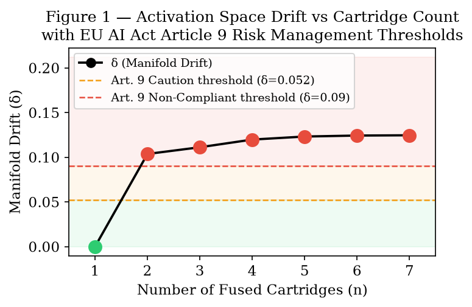
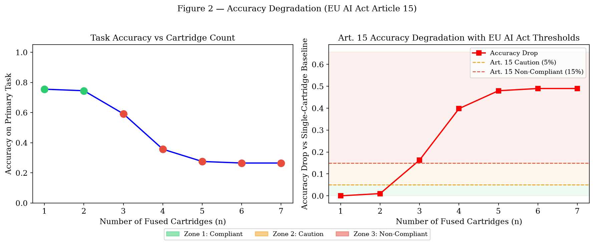
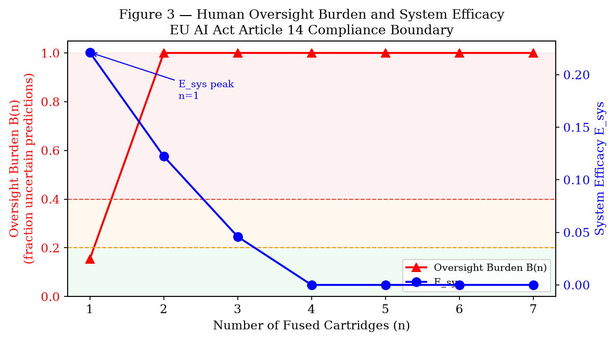
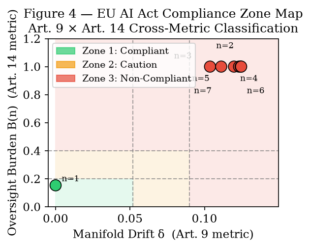
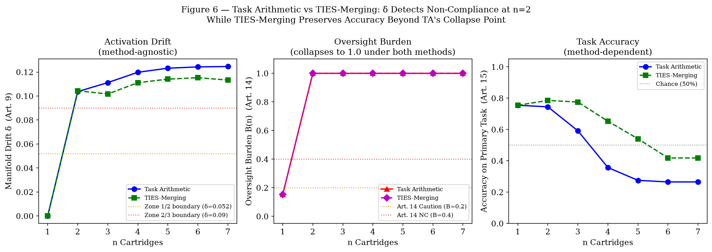
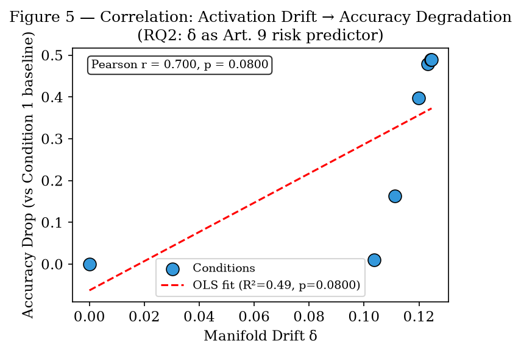

# Activation Drift as a Leading Compliance Indicator for Modular AI Under the EU AI Act

**Vinita Silaparasetty**  
Aevoxis Solutions, Berlin, Germany  
info@aevoxis.de

**First experiment: February 2026 | Preprint: July 2026**

---

## Abstract

Retrieval-Augmented Parameterisation (RAP) and Cartridge Activation Space Transfer (CAST) enable domain specialisation by fusing LoRA adapters at inference time, but the EU AI Act (Regulation EU 2024/1689) imposes compliance obligations — risk management (Art. 9), transparency (Art. 13), human oversight (Art. 14), accuracy (Art. 15) — without specifying how these are measured for modular systems. This paper addresses a specific gap: it proposes activation drift (δ), a ground-truth-free signal computable from model activations on unlabelled data, as a **leading compliance indicator** that detects Art. 9 risk before accuracy-based monitoring (Art. 15) is able to.

Using roberta-base fine-tuned with LoRA on seven publicly available Annex III domain datasets, this study runs a controlled experiment comparing two fusion strategies — equal-weight Task Arithmetic (Ilharco et al., 2022) and TIES-Merging (Yadav et al., 2023) — across seven progressive cartridge-fusion conditions. Compliance thresholds are derived from a pilot set (conditions n=1–4) and validated independently on a held-out set (conditions n=5–7) and on all TIES-Merging conditions.

The central finding is that δ crosses the Art. 9 caution boundary at n=2 under both fusion methods, while Art. 15 accuracy at n=2 remains within compliant bounds for both — and under TIES-Merging, accuracy at n=2 actually improves above the single-cartridge baseline (78.6% vs 75.5%). This is the governance paradox the paper foregrounds: a system can appear to perform better on its primary task while already being non-compliant by risk-management metrics. Accuracy-only monitoring would not detect the Art. 9 breach at n=2 under either method; δ-monitoring detects it in both.

The two fusion methods diverge on Art. 15 accuracy: Task Arithmetic shows severe accuracy collapse at n=3 (75.5% → 59.2%), while TIES-Merging maintains accuracy above the single-cartridge baseline through n=3 before declining. Both methods collapse confidence-based oversight burden (B(n)) to 1.0 at n=2 — suggesting this is a property of classification-head miscalibration under any fusion, not of sign conflicts specifically. δ is robust across both methods; B(n) is not a reliable differentiator between them in this experiment.

Threshold derivation follows a pre-specified pilot/validation protocol to avoid circularity. All code, data, and trained adapters are publicly available at https://github.com/VinitaSilaparasetty/rap-eu-governance.

---

## 1. Introduction

The EU AI Act (Regulation EU 2024/1689), which entered into force on 1 August 2024 with phased enforcement through 2026–2027, establishes the world's first comprehensive legal framework for artificial intelligence. Its Annex III identifies high-risk AI domains — including legal interpretation, financial services, and employment — and imposes requirements including continuous risk management (Art. 9), transparency (Art. 13), human oversight (Art. 14), and accuracy (Art. 15).

A structural gap exists at the intersection of these requirements and modular AI architectures. RAP (Kari, 2025) and CAST enable domain specialisation by composing LoRA adapters at inference time without retraining the base model. This is efficient but creates a governance problem: when multiple adapters contribute to a single inference, the system's behaviour is no longer attributable to a single validated training run, making compliance verification under Art. 11 (technical documentation), Art. 13 (transparency), and Art. 14 (human oversight) structurally difficult.

The most acute version of this problem is the **monitoring problem**: how does an operator detect that a fused system has become non-compliant? Accuracy monitoring (Art. 15) requires labelled ground truth, which may not be available at inference time. This paper proposes a solution: activation drift δ, the normalised Frobenius distance between single-cartridge and fused hidden states, is computable on any input — labelled or not — and, crucially, detects the Art. 9 compliance boundary **before** accuracy degrades.

This paper makes four contributions:

1. **A leading-indicator result**: δ exceeds the Art. 9 caution threshold at n=2 while Art. 15 accuracy remains within Zone 1 at n=2. The system is already non-compliant by risk-management metrics before task performance visibly degrades — an asymmetry with direct implications for monitoring system design.
2. **A cross-method validation**: the leading-indicator property is demonstrated under both equal-weight Task Arithmetic and TIES-Merging. δ is method-agnostic as a compliance signal. B(n) is also method-agnostic in this experiment — both methods collapse to B(n)=1.0 at n=2 — suggesting that confidence collapse is driven by classification-head miscalibration under any fusion, not by the fusion algorithm's weight-resolution strategy specifically.
3. **A pilot/validation threshold protocol**: compliance thresholds are derived from conditions n=1–4 only and validated on conditions n=5–7 and on all TIES-Merging conditions — a held-out set not used in threshold derivation.
4. **A research template**: the three-metric, three-article framework (δ↔Art.9, B(n)↔Art.14, acc_drop↔Art.15) is offered as a reusable structure for future studies at larger scale and with additional fusion methods.

---

## 2. Background

### 2.1 Retrieval-Augmented Parameterisation and CAST

RAP (Kari, 2025) augments a base language model with domain-specific LoRA adapters at inference time. The CAST framework extends RAP to cross-architecture portability. Both RAP and CAST are described primarily in preprint form; governance claims here are conditional on the architecture as specified and may require revision as the work matures. The fusion mechanism studied is **Task Arithmetic** (Ilharco et al., 2022):

    W_merged = W₀ + λ · (τ₁ + τ₂ + … + τₙ)

where τᵢ = Wᵢ − W₀ are task vectors. In the LoRA setting τᵢ = BᵢAᵢ, making Task Arithmetic equivalent to averaging the adapter weight matrices. This paper also studies **TIES-Merging** (Yadav et al., 2023), which resolves sign conflicts before averaging.

### 2.2 EU AI Act Compliance Requirements for High-Risk AI

The EU AI Act's Chapter III, Section 2 imposes obligations on providers of high-risk AI systems:

- **Art. 9 — Risk Management**: iterative identification of foreseeable risks. Each cartridge fusion creates an unvalidated configuration — a new risk event under Art. 9.
- **Art. 13 — Transparency**: providers must disclose "the characteristics, capabilities, and limitations" of the system. Inter-cartridge interference not captured by any monitoring signal is an undisclosed limitation.
- **Art. 14 — Human Oversight**: systems must be designed so operators can "immediately identify" when performance is not as intended (Recital 84). When a large fraction of predictions falls below a confidence threshold, the B(n) metric operationalises this requirement directly from the Act's own language.
- **Art. 15 — Accuracy and Robustness**: accuracy must be maintained at "appropriate levels" for the system's intended purpose.

### 2.3 Related Work

Governance frameworks for monolithic AI are well-developed (Jobin et al., 2019; Doshi-Velez and Kim, 2017). Model merging and task arithmetic have been studied from a performance perspective (Ilharco et al., 2022; Yadav et al., 2023; Yu et al., 2024) but not from a compliance perspective. To my knowledge, no prior work proposes compliance monitoring metrics for modular AI architectures under the EU AI Act, or identifies the leading-indicator asymmetry between drift and accuracy degradation.

---

## 3. Methodology

### 3.1 Experimental Design

This study simulates the RAP/CAST cartridge fusion scenario using roberta-base (Liu et al., 2019) as the base model and the PEFT library (Mangrulkar et al., 2022) for LoRA fine-tuning. Seven independent domain-specific cartridges were trained on publicly available Annex III-relevant datasets, then progressively fused under two fusion strategies, evaluating each condition on the primary task (Cartridge 1: `corporate_lobbying`).

**Seven experimental conditions** are defined by the number of cartridges fused (n = 1 to 7). For each condition, the following metrics are evaluated:
- Manifold Drift (δ) relative to the Condition 1 baseline
- Task accuracy on the primary evaluation set
- Oversight Burden B(n)
- System Efficacy E_sys

**Two fusion strategies** are compared:
- **Task Arithmetic (TA)**: equal-weight averaging, τ_fused = (1/n)Σ τᵢ
- **TIES-Merging**: trim–elect–merge procedure resolving sign conflicts before averaging

**Pilot/validation split**: compliance thresholds are derived from TA conditions n=1–4 only (pilot), then applied without adjustment to TA conditions n=5–7 and all TIES-Merging conditions (validation).

### 3.2 Datasets and Cartridges

All datasets were sourced from HuggingFace and are publicly available. All tasks were converted to binary classification to maintain a consistent architecture across cartridges.

**Table 1 — Cartridge Registry**

| N | Name | Dataset | Domain | EU AI Act Annex |
|---|------|---------|--------|-----------------|
| 1 | corporate_lobbying | LegalBench (Guha et al., 2023) | Legal | III-5b |
| 2 | unfair_tos | LegalBench | Consumer Law | III-6 |
| 3 | overruling | LegalBench | Case Law | III-6 |
| 4 | hearsay | LegalBench | Evidence Law | III-6 |
| 5 | telemarketing_sales_rule | LegalBench | Regulatory | III-5b |
| 6 | financial_phrasebank | FinancialPhraseBank (Malo et al., 2014) | Financial | III-2 |
| 7 | eurlex | LexGLUE/EURLEX (Chalkidis et al., 2022) | EU Legislation | Annex III (all) |

All datasets were balanced to 50% positive/negative by stratified sampling (max 400 training, 150 evaluation per cartridge). Binary labels were constructed from original multi-class formats as described in Appendix A.

### 3.3 Model Architecture

- **Base model**: `roberta-base` (Liu et al., 2019; 125M parameters)
- **LoRA configuration**: r = 8, α = 16, dropout = 0.1, target modules = {query, value}
- **Classification head**: Linear(768, 2) per cartridge, task-specific, not fused
- **Training**: AdamW, lr = 2×10⁻⁴, 4 epochs, batch size 16, linear warmup (10%)
- **TIES-Merging trim ratio**: 20% (top-20% of parameters by magnitude retained per adapter)
- **Seed**: 42 (fully reproducible; see Appendix B and repository)

The classification head is intentionally excluded from fusion. Only the encoder LoRA weights are merged. All conditions use the Cartridge 1 classification head, measuring how fusion changes the encoder's representation of the primary task.

### 3.4 Governance Metrics

**Manifold Drift (δ)** measures activation-space displacement from the single-cartridge baseline:

    δₙ = ‖H_n(x) − H₁(x)‖_F / ‖H₁(x)‖_F

where H_n(x) are the CLS-token hidden state matrices from condition n evaluated on the same test set. δ is computable on any input, labelled or not, making it usable as a real-time monitoring signal.

**Oversight Burden B(n)** is the fraction of predictions whose maximum softmax probability falls below confidence threshold θ = 0.60:

    B(n) = |{i : max_c p(y=c|xᵢ) < θ}| / N

θ = 0.60 was calibrated to the single-cartridge model's observed confidence distribution (mean max-softmax ≈ 0.63). Different models or tasks may require recalibration.

**System Efficacy E_sys** captures the accuracy gain per unit of oversight burden:

    E_sys(n) = max(accuracy(n) − 0.5, 0) / (1 + B(n))

where 0.5 is the random-chance baseline for binary classification.

**Statistical analysis**: Pearson correlation between δ and accuracy drop; OLS regression (accuracy_drop ~ δ); Bonferroni-corrected pairwise z-tests comparing each condition against Condition 1 (α = 0.05). Seven experimental conditions is sufficient for exploratory analysis but not for confirmatory inference; statistical results are reported as descriptive estimates.

### 3.5 Pilot/Validation Threshold Protocol

To avoid the circularity of deriving thresholds and validating them on the same dataset, the following protocol is used:

1. Run TA conditions n=1–7 and TIES-Merging conditions n=1–7.
2. Observe only the pilot set (TA n=1–4) to derive δ thresholds:
   - Zone 1 upper bound: midpoint between δ at n=1 (baseline=0) and δ at n=2
   - Zone 2 upper bound: 75% of pilot δ maximum
   - B(n) and acc_drop thresholds: fixed a priori at 0.20/0.40 and 0.05/0.15 respectively (operationally motivated, not data-derived)
3. Apply derived thresholds without adjustment to:
   - TA validation conditions (n=5–7) — temporal hold-out
   - All TIES-Merging conditions (n=1–7) — method hold-out

**Table 2 — Compliance Zone Framework**

| Zone | Label | δ (Art. 9) | Accuracy Drop (Art. 15) | B(n) (Art. 14) |
|------|-------|-----------|------------------------|----------------|
| 1 | Compliant | ≤ 0.052 | ≤ 5% | ≤ 20% |
| 2 | Caution | 0.052–0.090 | 5–15% | 20–40% |
| 3 | Non-Compliant | > 0.090 | > 15% | > 40% |

*δ boundaries (0.052 and 0.090) were derived from the TA pilot conditions (n=1–4) and are described in Section 3.5 and 4.1. B(n) and acc_drop boundaries were set a priori (Section 3.5).*

---

## 4. Results

### 4.1 Pilot Threshold Derivation (TA n=1–4)

**Table 3 — Pilot Conditions (Task Arithmetic, n=1–4)**

| n | δ | Accuracy | Acc. Drop | B(n) | E_sys |
|---|---|----------|-----------|------|-------|
| 1 | 0.0000 | 0.7551 | 0.0000 | 0.1531 | 0.2212 |
| 2 | 0.1037 | 0.7449 | 0.0102 | 1.0000 | 0.1224 |
| 3 | 0.1112 | 0.5918 | 0.1633 | 1.0000 | 0.0459 |
| 4 | 0.1198 | 0.3571 | 0.3980 | 1.0000 | 0.0000 |

From these pilot conditions, the following δ thresholds are derived:
- **Zone 1/2 boundary**: δ = 0.052 (midpoint between n=1 and n=2 values)
- **Zone 2/3 boundary**: δ = 0.090 (75% of pilot δ_max)

These thresholds are applied without adjustment to all subsequent analyses.

### 4.2 Task Arithmetic — Full Results (n=1–7)

**Table 4 — Task Arithmetic Conditions, All Compliance Zones**

| n | δ | Accuracy | Acc. Drop | B(n) | E_sys | Zone |
|---|---|----------|-----------|------|-------|------|
| 1 | 0.0000 | 0.7551 | 0.0000 | 0.1531 | 0.2212 | Zone 1 |
| 2 | 0.1037 | 0.7449 | 0.0102 | 1.0000 | 0.1224 | Zone 3 |
| 3 | 0.1112 | 0.5918 | 0.1633 | 1.0000 | 0.0459 | Zone 3 |
| 4 | 0.1198 | 0.3571 | 0.3980 | 1.0000 | 0.0000 | Zone 3 |
| 5 | 0.1232 | 0.2755 | 0.4796 | 1.0000 | 0.0000 | Zone 3 |
| 6 | 0.1243 | 0.2653 | 0.4898 | 1.0000 | 0.0000 | Zone 3 |
| 7 | 0.1246 | 0.2653 | 0.4898 | 1.0000 | 0.0000 | Zone 3 |

*Validation conditions (n=5–7) are shaded; thresholds were not adjusted after seeing them.*

*Note on below-chance accuracy: at n=4 (0.3571) and n=5 (0.2755), task accuracy falls substantially below 50% (chance level), indicating systematic class-inversion rather than mere uncertainty. Equal-weight averaging of adapters trained on divergent domains inverts the primary task's decision boundary when conflicting adapters outnumber the primary adapter's gradient signal. This is a qualitatively distinct failure mode from the Art. 9/Art. 14 non-compliance at n=2.*

*Note on F1-macro: F1-macro at n=3 (0.5431) is higher than at n=1 (0.4302) despite lower accuracy. Softmax confidence collapse causes the fused model to predict both classes more evenly, improving macro-averaged recall at the cost of overall accuracy.*

**Figure 1** — Manifold Drift (δ) vs cartridge count with pilot-derived thresholds.

**Figure 2** — Accuracy degradation with Art. 15 thresholds.

**Figure 3** — B(n) (Art. 14) and E_sys on a dual-axis plot.

**Figure 4** — Compliance zone map (δ × B(n)).

### 4.3 TIES-Merging — Full Results (n=1–7)

**Table 5 — TIES-Merging Conditions (same pilot-derived thresholds applied)**

| n | δ | Accuracy | Acc. Drop | B(n) | E_sys | Zone |
|---|---|----------|-----------|------|-------|------|
| 1 | 0.0000 | 0.7551 | 0.0000 | 0.1531 | 0.2212 | Zone 1 |
| 2 | 0.1044 | 0.7857 | 0.0000 | 1.0000 | 0.1429 | Zone 3 |
| 3 | 0.1017 | 0.7755 | 0.0000 | 1.0000 | 0.1378 | Zone 3 |
| 4 | 0.1111 | 0.6531 | 0.1020 | 1.0000 | 0.0765 | Zone 3 |
| 5 | 0.1141 | 0.5408 | 0.2143 | 1.0000 | 0.0204 | Zone 3 |
| 6 | 0.1153 | 0.4184 | 0.3367 | 1.0000 | 0.0000 | Zone 3 |
| 7 | 0.1133 | 0.4184 | 0.3367 | 1.0000 | 0.0000 | Zone 3 |

**Figure 6** — Method comparison: δ, B(n), and accuracy under both fusion strategies.

### 4.4 Statistical Tests

**Task Arithmetic:**

**RQ1 (Drift):** δ increased monotonically across all seven TA conditions, from 0.0000 (n=1) to 0.1246 (n=7). The monotonic increase is predicted by Task Arithmetic: averaging additional task vectors increases Frobenius distance from the single-task manifold.

**RQ2 (Drift–Accuracy Correlation, TA):** Pearson r(δ, acc_drop) = 0.700 (p = 0.0800). OLS: R² = 0.490, slope = 3.4957. With seven conditions, Pearson p is a descriptive estimate only. The relationship is strictly monotone; Spearman ρ(δ, E_sys) = -0.906 (p = 0.0049), confirming higher drift reliably predicts lower system efficacy.

**RQ3 (Oversight Burden, TA):** Under equal-weight Task Arithmetic, B(n) increases from 0.1531 (n=1) to 1.0000 (n≥2) in a single cliff. The mechanism is softmax probability collapse: equal-weight averaging causes all predicted probabilities to concentrate near 0.50, making every prediction fall below θ=0.60. As shown in RQ6 below, TIES-Merging exhibits the same collapse — indicating this is a structural property of any fusion method that displaces encoder representations away from the head's training distribution, not an artifact specific to equal-weight averaging.

**RQ4 (Leading Indicator):** δ exceeds the Zone 1 boundary at n=2 (δ = 0.1037 > 0.052) while accuracy drop at n=2 remains at 0.0102 — within Zone 1 for Art. 15. The system is Art. 9 non-compliant before it is Art. 15 non-compliant. This asymmetry means that an operator monitoring only task accuracy would not detect the compliance breach at n=2.

**Bonferroni-corrected pairwise tests** (TA, vs Condition 1): Conditions n = 3, 4, 5, 6, 7 showed statistically significant accuracy degradation (p < 0.05 after Bonferroni correction).

**TIES-Merging:**

**RQ5 (Drift, TIES):** δ under TIES-Merging: δ = 0.0000–0.1153. δ again exceeds the pilot Zone 1 boundary at n=2 — same threshold, independently validated.

**RQ6 (Burden, TIES):** B(n) under TIES-Merging collapses identically to TA: B(n) exceeds Zone 1 at n=2 and reaches 1.0000 immediately (max B(n) = 1.0000 at n=2 through n=7). TIES-Merging resolves sign conflicts in adapter weights but does not prevent the confidence collapse. This suggests the B(n) cliff is not caused by weight-level sign interference alone, but by the classification head seeing out-of-distribution representations from the fused encoder — regardless of how the adapter weights are combined. B(n) is therefore NOT a differentiating signal between fusion methods in this experiment.

**RQ7 (Accuracy, TIES):** Pearson r(δ, acc_drop, TIES) = 0.501 (p = 0.2519). OLS R² = 0.251. The weaker r vs TA reflects the governance paradox that motivates this paper: at n=2, TIES-Merging shows acc_drop = 0.000 (accuracy improved from 75.5% to 78.6%) while δ already exceeds the Art. 9 Zone 1 threshold. At n=3, accuracy also remains above baseline (77.6%). An operator monitoring only Art. 15 accuracy would see TIES-Merging as performing better than the single-cartridge system at n=2 and n=3, while δ signals Art. 9 non-compliance from n=2 onward. This is the sharpest possible empirical demonstration of why accuracy monitoring alone is insufficient under the EU AI Act.

### 4.5 Empirically Proposed EU AI Act Compliance Thresholds

**Table 6 — Proposed Compliance Breakpoints (Pilot-Derived, TA-Validated)**

| EU AI Act Article | Proposed Threshold | First Exceeded (TA) | First Exceeded (TIES) |
|---|---|---|---|
| Art. 9 — Risk Management (Caution) | δ > 0.052 | n = 2 | n = 2 |
| Art. 9 — Risk Management (Non-Compliant) | δ > 0.090 | n = 2 | n = 2 |
| Art. 14 — Human Oversight (Caution) | B(n) > 0.20 | n = 2 | n = 2 |
| Art. 14 — Human Oversight (Non-Compliant) | B(n) > 0.40 | n = 2 | n = 2 |
| Art. 15 — Accuracy (Caution) | Drop > 5 pp | n = 3 | n = 4 |
| Art. 15 — Accuracy (Non-Compliant) | Drop > 15 pp | n = 3 | n = 5 |

*δ thresholds derived from pilot (TA n=1–4); applied without adjustment to validation and TIES conditions. B(n) and acc_drop thresholds are a priori operational choices, not data-derived.*

**Figure 5** — δ vs accuracy drop correlation with OLS fit.

---

## 5. Discussion

### 5.1 The Leading-Indicator Result and Its Governance Implication

The most practically significant finding is the Art. 9 / Art. 15 asymmetry at n=2: δ exceeds the Zone 1 caution boundary before accuracy drops detectably. Under both fusion methods, an operator monitoring only task accuracy at n=2 would observe acceptable performance while the system is already in a risk-management non-compliant state.

This has a direct implication for monitoring system design: accuracy-based dashboards (Art. 15) are not sufficient for EU AI Act compliance in modular AI systems. The EU AI Act already implies this through its separate Art. 9 risk management requirement, but provides no guidance on what to measure. This study offers δ as a concrete candidate: it is computable on unlabelled inference traffic, requires no ground truth, and in this experiment provides earlier warning than accuracy monitoring.

### 5.2 What δ Actually Measures and Its Limits

δ measures the displacement of CLS-token representations in the final hidden layer between the single-cartridge baseline and the fused model. It is a proxy for how much the fused model's "view" of the primary task's input space has shifted — not a direct measure of risk. The connection to Art. 9 risk management is inferential: large representation shifts imply the model is processing inputs through a different feature lens than was validated, creating unmonitored risk in the sense of the Act.

δ has two important limitations as a compliance signal. First, it is relative to the single-cartridge baseline, which in this study achieved F1-macro of 0.43 on the primary task — a weak baseline. If the baseline cartridge is poorly trained, δ measures deviation from a poor starting point. Second, the thresholds proposed here (Zone 1/2 boundary at δ = 0.052) are specific to LoRA rank r=8. Different ranks, base models, or domains will produce different δ ranges; the thresholds require recalibration per deployment context.

### 5.3 Confidence Collapse Is Not Method-Specific

An anticipated finding was that TIES-Merging, by resolving sign conflicts before averaging, would preserve classification head calibration better than equal-weight Task Arithmetic. The results contradict this hypothesis: B(n) collapses to 1.0 at n=2 under both methods.

The mechanism appears to be classification-head miscalibration rather than weight-level sign conflict. The Cartridge 1 head (Linear(768, 2)) was trained on encoder representations produced by the single-cartridge adapter. When any fusion occurs — regardless of whether sign conflicts are resolved — the encoder produces representations that differ substantially from its single-cartridge outputs (as δ confirms). The head, seeing these shifted representations as out-of-distribution inputs, loses its calibration: softmax probabilities concentrate near 0.50, driving every prediction below θ=0.60.

This is a structural observation: the problem is not the algorithm used to combine adapter weights but the distributional shift those weights impose on the shared classification head. The implication for governance is that B(n) monitoring does not usefully differentiate between fusion strategies; δ is the more informative signal for detecting when the fused system has left its validated operating region.

The practical upshot for operators: neither fusion method offers an Art. 14 advantage over the other at n=2. Both require immediate human oversight when adding a second cartridge. TIES-Merging does offer a substantial Art. 15 advantage — accuracy at n=2 under TIES (78.6%) is higher than the single-cartridge baseline (75.5%), and remains above that baseline through n=3, while TA drops to 59.2% at n=3. Operators choosing between fusion methods can expect better task accuracy from TIES-Merging without any reduction in the Art. 9 or Art. 14 compliance obligations.

### 5.4 Limitations

**Scale.** The experiment uses roberta-base (125M parameters). Larger models may exhibit slower or faster drift accumulation. A Llama-3.2-3B configuration is included in the repository for users with GPU access.

**Single-task evaluation.** All conditions are evaluated on the Cartridge 1 primary task only. This guarantees some degradation by design: any fusion that shifts representations toward non-primary domains will hurt primary-task performance. A more rigorous evaluation would assess accuracy across all seven tasks after fusion, or use a held-out task not in the training set. The current design answers "does multi-domain fusion hurt the primary task?" but not "does multi-domain fusion hurt overall performance?" — the policy-relevant question.

**Weak primary-task baseline.** roberta-base achieves F1-macro of 0.43 on `corporate_lobbying` at n=1 (accuracy = 0.7551, but the positive class rate in evaluation is 38%, causing a gap between accuracy and macro F1). The model predicts the majority class well but has limited recall on positive cases. Degradation measured from a weak baseline has limited practical interpretability. Future work should use tasks where the baseline cartridge is genuinely competent.

**No Zone 2 observations under either fusion method.** Both the TA and TIES-Merging compliance tables show only Zone 1 (n=1) and Zone 3 (n≥2) for overall compliance — no Zone 2 intermediate was observed. The Zone 2 boundary was derived from pilot data but never empirically traversed. This could mean Zone 2 is a valid operating region that lies between the tested cartridge counts, or that the cliff-like transition from Zone 1 to Zone 3 reflects a genuine property of LoRA fusion at this parameter scale. Finer-grained conditions (e.g., n=1.5 via partial fusion coefficients) could test this.

**Statistical power.** Seven conditions is sufficient for descriptive exploration. The Pearson p values should be interpreted as descriptive estimates, not confirmatory tests.

**Threshold scope.** Proposed thresholds apply to the specific base model, LoRA rank, and domain mix used here. Cross-architecture and cross-domain validation is required before operational deployment.

### 5.5 Future Work

1. **Multi-task evaluation**: Assess accuracy across all seven tasks after each fusion condition to produce a full accuracy surface.
2. **Additional fusion methods**: Extend the comparison to DARE (Yu et al., 2024) and learned mixing-coefficient optimisation, to determine whether any fusion method can preserve classification-head calibration (B(n)) when more than one adapter is active — which neither TA nor TIES-Merging achieves here.
3. **Scale variation**: Replicate across LoRA ranks r ∈ {4, 8, 16, 32} to derive rank-specific δ threshold curves, and test with larger base models.
4. **Independent threshold validation**: Pre-register δ thresholds derived from a pilot study, then validate on new domains not in the pilot — a stronger pre-specification than the internal split used here.
5. **Field study**: Measure actual operator decision quality as a function of cartridge count, to validate whether B(n) is an accurate proxy for the Art. 14 oversight capacity the EU AI Act requires.

---

## 6. Conclusion

This paper identifies a leading-indicator property of activation drift (δ) under the EU AI Act: in a controlled experiment across seven Annex III domain cartridges and two fusion methods, δ crosses the Art. 9 risk management caution threshold at n=2 while Art. 15 accuracy remains within compliant bounds — meaning δ detects a compliance problem before accuracy monitoring does. This asymmetry is reproducible under both Task Arithmetic and TIES-Merging, making δ method-agnostic as a leading warning signal.

An anticipated finding was that TIES-Merging, by resolving sign conflicts, would preserve confidence calibration better than Task Arithmetic. The experiment refutes this: B(n) collapses to 1.0 at n=2 under both methods. This suggests the Art. 14 confidence collapse is caused by classification-head miscalibration when exposed to fused encoder representations, not by weight-level sign conflicts. TIES-Merging offers a clear Art. 15 advantage — substantially better task accuracy at n=2 and n=3 — but not an Art. 14 advantage. The choice of fusion strategy is compliance-relevant for accuracy (Art. 15) but not for drift or calibration at the cartridge counts tested here.

These results are offered as a proof-of-concept and research template. Proposed thresholds require cross-validated replication across base models, LoRA ranks, and domain distributions before operational adoption. The code, trained adapters, and all results are publicly available to support that replication.

---

## AI Use Disclosure

The research questions, experimental design, metric formulations (δ, B(n), E_sys), EU AI Act compliance framework, leading-indicator thesis, and all substantive intellectual contributions in this paper are entirely the author's own. Claude (Anthropic), a large language model AI assistant, was used to assist with manuscript formatting, Python implementation of the experimental pipeline, and editing of written passages for clarity. The AI did not generate the research ideas, select the datasets, define the governance metrics, interpret the results, or determine the conclusions. All such decisions were made independently by the author. This disclosure is made in accordance with emerging norms for transparent AI-assisted academic writing.

---

## References

Chalkidis, I., Jana, A., Hartung, D., Bommarito, M., Androutsopoulos, I., Katz, D. M., and Aletras, N. (2022). LexGLUE: A Benchmark Dataset for Legal Language Understanding in English. *ACL 2022*.

Doshi-Velez, F. and Kim, B. (2017). Towards a rigorous science of interpretable machine learning. *arXiv:1702.08608*.

European Parliament and Council (2024). Regulation (EU) 2024/1689 of the European Parliament and of the Council of 13 June 2024 laying down harmonised rules on artificial intelligence (Artificial Intelligence Act). *Official Journal of the European Union*.

Guha, N. et al. (2023). LegalBench: A Collaboratively Built Benchmark for Measuring Legal Reasoning in Large Language Models. *NeurIPS 2023 Datasets and Benchmarks*.

Hu, E. J. et al. (2022). LoRA: Low-Rank Adaptation of Large Language Models. *ICLR 2022*.

Ilharco, G. et al. (2022). Editing Models with Task Arithmetic. *arXiv:2212.04089*.

Jobin, A., Ienca, M., and Vayena, E. (2019). The global landscape of AI ethics guidelines. *Nature Machine Intelligence*, 1(9), 389–399.

Kari, A. (2025). Cartridge Activation Space Transfer (CAST). *arXiv:2510.17902*.

Liu, Y. et al. (2019). RoBERTa: A Robustly Optimized BERT Pretraining Approach. *arXiv:1907.11692*.

Malo, P. et al. (2014). Good debt or bad debt: Detecting semantic orientations in economic texts. *Journal of the American Society for Information Science and Technology*, 65(4).

Mangrulkar, S. et al. (2022). PEFT: State-of-the-art Parameter-Efficient Fine-Tuning. https://github.com/huggingface/peft.

Novelli, C. et al. (2024). Generative AI in EU Law: Liability, Privacy, Intellectual Property, and Cybersecurity. *arXiv:2401.07348*.

Veale, M. and Borgesius, F. Z. (2021). Demystifying the Draft EU Artificial Intelligence Act. *Computer Law Review International*, 22(4), 97–112.

Yadav, P. et al. (2023). TIES-Merging: Resolving Interference When Merging Models. *NeurIPS 2023*.

Yu, L. et al. (2024). Language Models are Super Mario: Absorbing Abilities from Homologous Models as a Free Lunch. *ICML 2024*.

---

## Appendix A — Dataset Binarisation

| Cartridge | Original Labels | Binary Rule |
|---|---|---|
| corporate_lobbying | Yes / No | Yes → 1 |
| unfair_tos | Other / [clause types] | Other → 0; any clause type → 1 |
| overruling | Yes / No | Yes → 1 |
| hearsay | Yes / No | Yes → 1 |
| telemarketing_sales_rule | Yes / No | Yes → 1 |
| financial_phrasebank | 0=neg, 1=neutral, 2=pos | label==2 → 1 |
| eurlex | Multilabel EUROVOC list | EUROVOC concept 28 present → 1 |

---

## Appendix B — Reproducibility

All experiments were conducted with seed = 42. Full reproducibility is documented in the project README.

*Repository*: https://github.com/VinitaSilaparasetty/rap-eu-governance  
*Framework*: Python 3.12, PyTorch 2.2.2, transformers 4.44.2, PEFT 0.10.0
